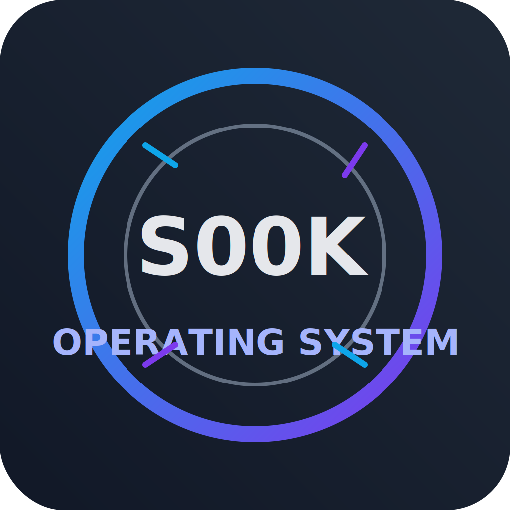

# S00K OS


A lightweight, educational operating system built from scratch featuring a monolithic kernel architecture with comprehensive security, memory management, and file system capabilities.



## 🚀 Features

- **Monolithic Kernel Architecture**: Efficient single-address-space design
- **Advanced Memory Management**: Two-level paging with 4KB pages, buddy system, and slab allocator
- **Hierarchical File System**: In-memory VFS with directory structures and file operations
- **Multi-layered Security**: Role-based access control with privilege levels (GUEST, USER, ADMIN, KERNEL)
- **Performance Monitoring**: Built-in profiling and performance tracking
- **Comprehensive Testing**: Unity-based testing framework with regression testing
- **Command-line Shell**: Interactive interface with built-in commands
- **Error Handling**: Robust error management with severity levels and recovery

## 📋 System Requirements

### Minimum Requirements
- x86 (i386) processor or emulator
- 128MB RAM
- Floppy disk image (1.44MB) or hard disk image
- VGA-compatible display

### Development Requirements
- NASM assembler
- GCC (32-bit cross-compiler)
- GNU Make
- QEMU system emulator
- GDB debugger (optional, for debugging)

## 🛠️ Quick Start

### Option 1: Automated Setup (Recommended)

1. **Clone the repository**:
   ```bash
   git clone <repository-url>
   cd my-own-os
   ```

2. **Run the setup script**:
   ```bash
   chmod +x setup_environment.sh
   ./setup_environment.sh
   ```

3. **Run the OS**:
   ```bash
   qemu-system-i386 -drive format=raw,file=S00K_OS.img
   ```

### Option 2: Manual Setup

1. **Install dependencies**:
   ```bash
   # Ubuntu/Debian
   sudo apt-get install build-essential nasm gcc gdb qemu-system-i386

   # macOS
   brew install nasm i686-elf-gcc qemu

   # Windows: Use MinGW-w64 or Cygwin
   ```

2. **Build the OS**:
   ```bash
   chmod +x build_image.sh
   ./build_image.sh
   ```

3. **Run in QEMU**:
   ```bash
   qemu-system-i386 -drive format=raw,file=S00K_OS.img
   ```

## 📖 Usage Guide

### Boot Process
1. **Power On**: BIOS loads the bootloader from sector 0
2. **Bootloader**: Initializes hardware and loads kernel to 0x1000
3. **Kernel**: Initializes subsystems and starts shell interface
4. **Shell**: Interactive command-line interface becomes available

### Available Commands

| Command | Description | Example |
|---------|-------------|---------|
| `help` | Show available commands | `help` |
| `clear` | Clear the screen | `clear` |
| `echo <text>` | Display text | `echo Hello World` |
| `ls` | List files and directories | `ls` |
| `cat <file>` | Display file contents | `cat readme.txt` |
| `touch <file>` | Create empty file | `touch newfile.txt` |
| `mkdir <dir>` | Create directory | `mkdir mydir` |
| `rm <file>` | Remove file | `rm oldfile.txt` |
| `rmdir <dir>` | Remove directory | `rmdir emptydir` |
| `cp <src> <dst>` | Copy file | `cp source.txt dest.txt` |
| `mv <src> <dst>` | Move/rename file | `mv old.txt new.txt` |
| `profile` | Show performance metrics | `profile` |
| `security` | Show security status | `security` |
| `logout` | Exit shell | `logout` |

### File System Operations

The OS includes an in-memory hierarchical file system:

```bash
# Create a directory structure
mkdir documents
cd documents
mkdir projects
touch readme.txt

# Write to a file
echo "My project documentation" > readme.txt

# Read file contents
cat readme.txt

# List contents
ls -la
```

### Security Features

The OS implements role-based access control:

```bash
# Login with different privilege levels
login guest    # GUEST level - limited access
login user     # USER level - standard access  
login admin    # ADMIN level - elevated access

# Check current security level
security

# View security audit log
security log
```

### Performance Monitoring

Built-in performance profiling:

```bash
# Show system performance metrics
profile

# View memory usage
profile memory

# View I/O statistics
profile io
```

## 🏗️ Architecture Overview

### System Architecture

```
┌─────────────────────────────────────────────────────────────┐
│                    User Applications                      │
├─────────────────────────────────────────────────────────────┤
│                      Shell Interface                        │
├─────────────────────────────────────────────────────────────┤
│         System Services (File System, Memory, I/O)        │
├─────────────────────────────────────────────────────────────┤
│                      Kernel Core                          │
├─────────────────────────────────────────────────────────────┤
│              Hardware Abstraction Layer (HAL)              │
├─────────────────────────────────────────────────────────────┤
│                    Hardware Layer                          │
└─────────────────────────────────────────────────────────────┘
```

### Key Components

- **Bootloader** (`src/bootloader.asm`): 512-byte boot sector that loads the kernel
- **Kernel** (`src/kernel.c`): Core system initialization and management
- **Memory Management** (`src/memory_management.c`): Paging, allocation, and memory tracking
- **File System** (`src/file_system.c`): VFS implementation with inode-based structure
- **I/O System** (`src/io.c`): Console input/output and device management
- **Security** (`src/security.c`): Authentication and authorization system
- **Shell** (`src/shell.c`): Command-line interface and built-in commands

### Memory Layout

```
0x00000000 - 0x00000FFF    Reserved (4KB)
0x00001000 - 0x000FFFFF    Kernel Space (1MB)
0x00100000 - 0x07FFFFFF    User Space (127MB)
0x08000000 - 0xFFFFFFFF    Reserved/Unused (2GB)
```

## 🔧 Development

### Building from Source

```bash
# Clean build
make clean
make

# Build with specific optimizations
make CFLAGS="-O2 -DDEBUG"

# Build individual components
nasm -f bin src/bootloader.asm -o bin/boot.bin
gcc -m32 -ffreestanding -c src/kernel.c -o bin/kernel.o
```

### Testing

```bash
# Run all tests
make test

# Run specific test suite
./tests/test_runner security
./tests/test_runner memory
./tests/test_runner filesystem

# Run performance regression tests
./tests/test_performance_regression
```

### Debugging

```bash
# Run with GDB debugging
qemu-system-i386 -s -S -drive format=raw,file=S00K_OS.img

# In another terminal
gdb
(gdb) target remote localhost:1234
(gdb) break kernel_main
(gdb) continue
```

### Development Aliases

Source the development configuration for convenient aliases:

```bash
source dev_config.sh

# Now you can use:
s00k-build    # Build the OS image
s00k-run      # Run in QEMU
s00k-debug    # Run with GDB debugging
```

## 📊 Performance

The OS includes comprehensive performance monitoring:

- **Memory Usage**: Real-time tracking of allocated/freed memory
- **I/O Statistics**: Console input/output performance metrics
- **System Calls**: Performance profiling of kernel operations
- **Boot Time**: Measured and optimized boot sequence

## 🔒 Security

Security features include:

- **Authentication**: User login system with privilege levels
- **Authorization**: Role-based access control
- **Memory Protection**: Paging-based isolation
- **Input Validation**: Comprehensive parameter checking
- **Audit Logging**: Security event tracking

## 📚 Documentation

Comprehensive documentation is available in the `docs/` directory:

- **[User Guide](docs/user_guide.md)**: Complete usage instructions and examples
- **[Architecture Overview](docs/architecture_overview.md)**: Technical architecture details
- **[Performance Report](PERFORMANCE_OPTIMIZATION_REPORT.md)**: Performance analysis and optimizations

## 🤝 Contributing

1. Fork the repository
2. Create a feature branch (`git checkout -b feature/amazing-feature`)
3. Commit your changes (`git commit -m 'Add amazing feature'`)
4. Push to the branch (`git push origin feature/amazing-feature`)
5. Open a Pull Request

## 📝 License

This project is licensed under the MIT License - see the LICENSE file for details.

## 🙏 Acknowledgments

- OSDev Wiki for invaluable development resources
- QEMU emulator for testing and development
- NASM assembler for reliable assembly compilation
- Unity testing framework for comprehensive testing

## 📞 Support

For support and questions:
- Check the documentation in `docs/`
- Review the troubleshooting section in the user guide
- Create an issue in the repository

---

**Happy coding with S00K OS!** 🎉
